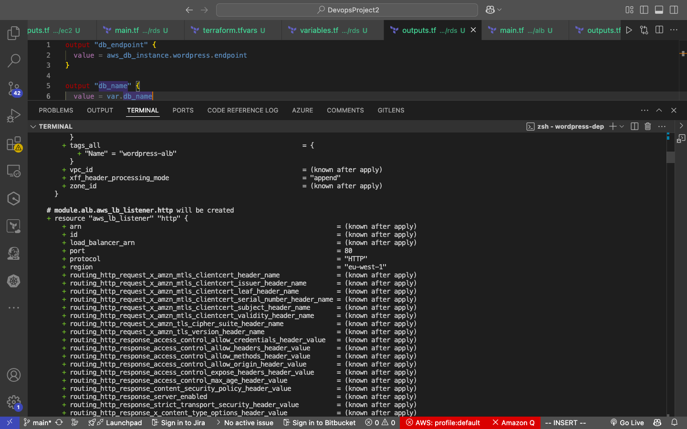
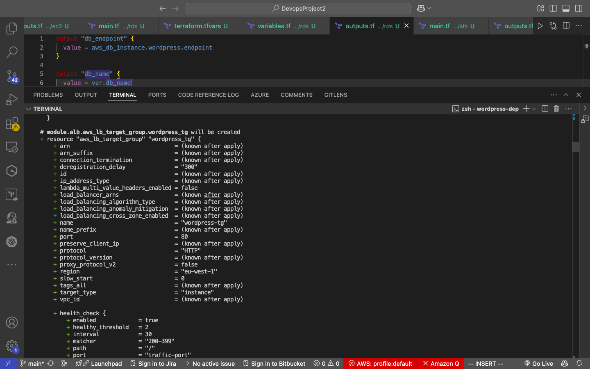
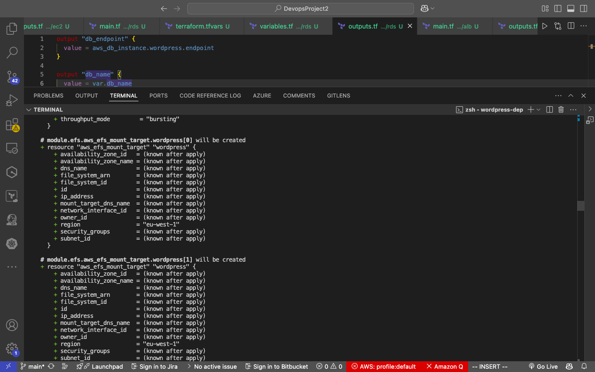

# Capstone Project: Deploy Wordpress website

For this project, we were meant to use the aws console, but due to my devops background I chose to use terraform to create it. This method allows it to be easily reproducable. 

## Project Objectives
A small to mid-sized digital marketing agency "DigitalBoost".
would like to enhance its online presence by creating a high-preformance, scalable, secure and cost-effective solution that can handle increasing traffic and seamlessly integrate with their existing infrastructure. 

## Approach

In order to successfully implement this; using terraform to create resources on AWS to build a high-scalable secure and cost-effective infrastructure, I created a custom VPC with the given IP and cidr. 

- VPC

selecting a region is also important.

In the vpc I went on to specify the number of public & private subnets. Following this I created a route table with association adding an auto-scaling group that helped me create my instances, I also set the minimum instances avaliable at 2. This was more dynamic and cost effective. The following are all the screenshots up to the wordpress website being accessed. Terraform allowed me to create everything completely through the iac.

I also created a bastion instance placed in the public that only allowed traffic from my own IP address, to allow me to ssh into the private instances to troulbshoot. After my setup I was still not able to access the site. During my troubleshooting I found out that the `install_wordpress.sh` file had an old version of php, after changing the php service to the latest everything worked perfectly. 

---
